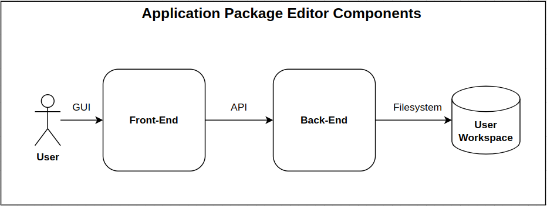

# Architectural Design

## Introduction

The Application Package Editor has two main components which are the frontend and backend as shown
on the figure *Components Overview*. The frontend manages the user interactions with the editor
while the backend is responsible for storing and managing the Application Packages of the user in
their Workspace.
The backend also integrates an [Application Package Validator](https://github.com/EOEPCA/app-package-validation)
that is used to validate the AP CWL documents when loaded in the frontend or when explicitly
requested by the user. The frontend communicates with the backend though the API that is exposed by
the backend. This API allows managing (list, create, update, lock/unlock, and delete) the 
Application Package Versions that are present in the user's Workspace.


*<p style="text-align: center;">Components Overview</p>* 

## frontend

As mentioned above, the frontend is responsible for managing the user interaction with the editor.
Thus, it provides a Graphical User Interface which:

  - Is implemented in a form based way using VueJS and Bootstrap.
  - Allows uploading / downloading Application Packages (CWL documents) to and from the user's
    local system.
  - Allows the management of the user Application Packages that are present in the user Workspace.
    In order to achieve this, it communicates with the backend in order to open/lock/save/delete
    Application Packages and their versions.

## backend

On the other hand, the backend is responsible for the validation of the AP CWL definitions and the
management of the AP CWL files in the user workspace. It is implemented using the FastAPI library
and expose an API to manage the Application Packages of the user Workspace. It exposes the
following API endpoints which are used by the frontend to interact with the user workspace:
    

*<p style="text-align: center;">API Endpoints</p>* 

On the backend the files are stored in a tree structure. Each application is represented by its own
directory. All application package versions are stored as individual CWL files in this directory.
An example file structure could be the following:

```
├── application_package_one
│   └── version_1.cwl
└── a_different_application
    ├── version1__locked.cwl
    ├── version3.cwl
    ├── version4.cwl
    └── version6.cwl
```

Locked files include the suffix "`__locked`" in their base name (extension excluded). The backend
refuses to delete locked files. To delete such a file it must be explicitly unlocked using the
"Manage" button on the frontend or using the `PATCH .../unlock/` endpoint on the backend API.
