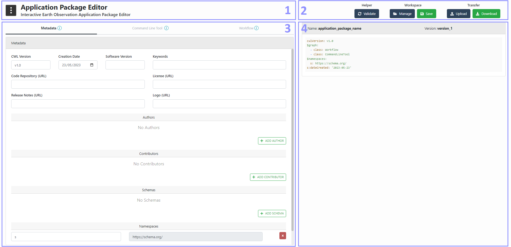
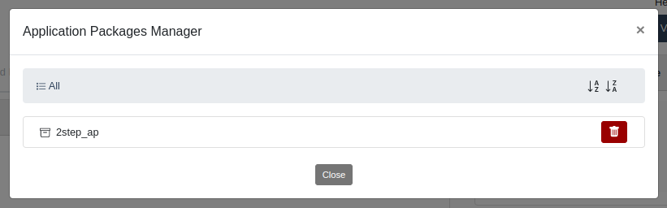
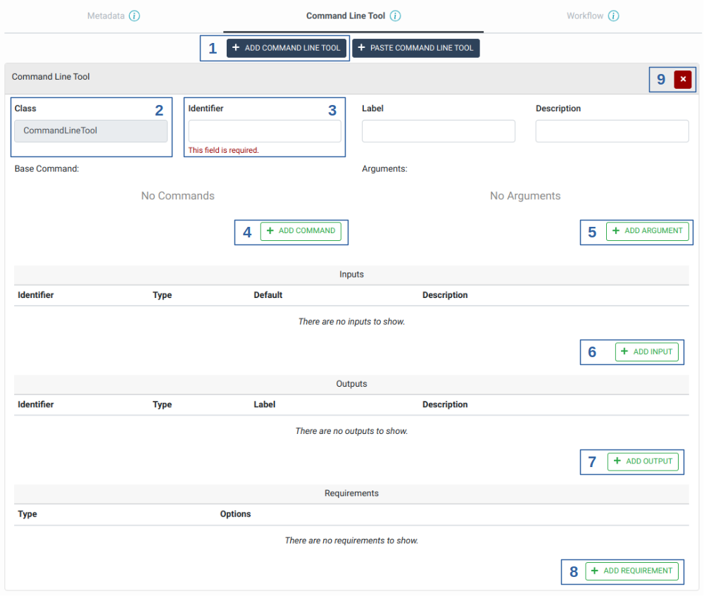
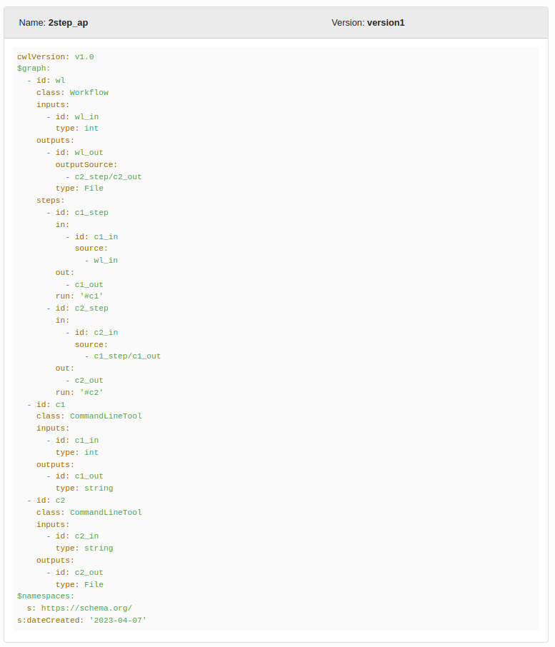

# User Manual

**Abstract**

This document is the EO Application Package Editor User Manual. Its
purpose is to describe the features and the capabilities supported by
the Application Package Editor in order to make it easy to get started
with it.

| Organisation  | Name              | Contact                               |
|------------   |-----------------  |---------------------------------------|
| SpaceApps     |Bernard Valentin   |bernard.valentin@spaceapplications.com |
| SpaceApps     |Mounir Hafif       |mounir.hafif@spaceapplications.com     |
| SpaceApps     |Jannes Lathouwers  |jannes.lathouwers@spaceapplications.com|
| SpaceApps     |Patrick Laport     |patrick.laport@spaceapplications.com   |

**Online version**

An online version of this documentation is available at <https://eoepca.github.io/eoepca-ap-editor/>

**Abbreviations and Acronyms**

| Abbreviations / Acronyms  | Definition                    |
| ------------------------  | ----------------------------- |
| EO                        | Earth Observation             |
| AP                        | Application Package           |
| CLT                       | Command Line Tool            
| CWL                       | Common Workflow Language      |
| GUI                       | Graphical User Interface      |
| ESA                       | European Space Agency         |
| BP                        | Best Practice                 |
| OGC                       | Open Geospatial Consortium    |

## Introduction 

This document describes the features and capabilities implemented in the
EO Application Package Editor.

### General Concepts

The Application Package Editor is an online web based tool for creating
EO Application Packages in an interactive manner. The tool allows to
create an Application Package and edit its three main parts as defined
in the [OGC Best Practice for Earth Observation Application
Package](https://docs.ogc.org/bp/20-089r1.html) which are:

-   **Metadata**: Additional metadata which provides a minimal amount of
    information about the Application Package to encourage correct
    citation.
-   **Command Line Tool** (also called Processing Task): An executable,
    non-interactive program that reads some inputs, performs a
    computation, and terminates after producing some outputs.
-   **Workflow**: a process characterized by multiple subprocess steps,
    where a step is a CommandLineTool and its outputs can be connected
    to the inputs of downstream steps to form a directed acyclic graph.
    A workflow may have inputs and produce outputs from the execution of
    all of its subprocess steps.

The tool uses a form based interface which is divided according to the
three main parts of an Application Package. These forms allow users to:

-   Enter **Metadata** for the Application Package by defining the
    software version, the authors and contributors, etc.
-   Add **Command Line Tool** with their required information such as
    the executable command, its inputs and outputs with their types as
    well as specific requirements that must be met in order to execute
    the process.
-   Define the **Workflow** inputs and outputs with their types as well
    as the subprocess steps to be executed with the mapping of their
    inputs and outputs.

The tool generates an Application Package that can be stored and
versioned in the backend or downloaded as a CWL file. You can also
select a stored Application Package version or upload a previously
generated one which will automatically fill the editor with the
Application Package content allowing further edition of the latter.

## Application Package Creation Guidelines

In general, creating a consistent new Application Package can be
achieved by following these steps in the editor:

1.  Define all of the processing tasks (Command Line Tool) that will be
    executed in the workflow. A processing task is considered complete
    when its identifier is defined as well as the command to be executed
    with all of its needed inputs, outputs and arguments.
2.  Define the inputs of the workflow process. Once it is done, the
    steps of the workflow can be added which will use the previously
    defined processing tasks with a mapping for their inputs. Finally,
    define the outputs of the workflow by mapping them to the outputs of
    one or more of its steps.

The metadata of the Application Package can be defined at any moment
since the information that is set in it is not used by the Command Line
Tool or Workflow parts.

## Application Package Editor

### Interface Overview

The Application Package Editor Tool interface is divided in 4 distinct
sections with their own purpose as shown in the *Editor GUI Overview* figure:

1.  **Header section**: This section includes a Help Menu that provides
    users with multiple useful links and features such as guided tours
    or Application Package examples.
2.  **File Management Section**: This section provides users with a set
    of buttons that allows users to validate and manage the CWL file
    generated by the editor. Users here can choose from where to open or
    save an Application Package (CWL file) as well as edit the name of
    it and its version.
3.  **Editor Section**: This section is the main part of the editor tool
    which is responsible for the interactive edition of the Application
    Package Editor.
4.  **Viewer Section**: This section is a runtime viewer of the
    Application Package generated CWL file that will be saved when using
    the File Management Section.

*
Editor GUI Overview
*

### Header Section

The header section provides a helper menu from which users can change
general settings of the Application Package Editor or open
documentation, examples and guided tours on how to use the interactive
Application Package Editor. The helper menu provide the following
actions as can be seen in the *Helper Menu* figure:

-   **Reset Editor**: Reset the editor to a default state without any
    Application Package loaded. The user is asked to confirm this action
    as it may lead to unsaved changes if an Application Package was
    already being edited.
-   **Editor Mode Selector**: Allow users to choose between Simple and
    Advanced mode of the editor. In Advanced mode, the forms of the
    editor show additional fields which are normally hidden in Simple
    mode as they are not required. Simple mode is the default one as it
    makes the interface look simpler and less complex.
-   **Manuals & References**: Allow users to access useful documentation
    about the Application Package Editor such as the User Manuals and
    OGC Best Practice for building an EO Application Package.
-   **Applications Package Examples**: Allow users to open Application
    Packages Examples directly in the Editor. Users can use these
    examples as a starting template and save them after edition.
-   **Guided Tours**: Provide users with a set of interactive guided
    tours that introduce the main sections and features of the editor:
    Metadata, Command Line Tool (paste and create) and Workflow.

*
Helper Menu
*

### File Management Section

The file management section provides users with a set of actions to
perform on the Application Package CWL file that is generated/edited by
the editor. The possible actions are shown in the *File Management Action* figure.

*
File Management Actions
*

#### Validation

The Validate button allows users at any moment during the editing of
their Application Package to verify that the generated CWL file is valid
against the CWL schema and the OGC BP EO Application Package requirements.
Note that this validation is also performed each time the users open a new
Application Package in the editor.

The button and its associated menu allow checking the AP against three levels
of requirements, which results in three types of responses: errors, hints and
notes.

Clicking the Validate button performs the verification at error level. In
that case the report may only contains errors, but not hints and notes.

To obtain hints and notes, expand the Validate menu and select the entry
corresponding to the desired level: "Include hints" or "Include hints and
notes". In all cases, errors are detected.

*
Application Package Validation Menu
*

When the validation report is not empty, this is displayed in a popup box.
Each entry in the report is associated to the requirement that is not met.

*
Application Package Validation Report
*

If the validation report is empty, a notification is displayed stating
that the Application Package CWL is valid.

*
Application Package Validation Successful
*

#### Workspace Actions

The Workspace Actions are directly responsible for managing and saving
the Application Packages of the user in its workspace. Two actions are
available:

-   **Manage**: The Manage button opens a manager that allows users to
    explore and manage the Application Packages saved in their
    workspace. Users have the possibility to navigate between
    Application Packages and see the different versions of an
    Application Package. This manager also provides version specific
    actions that allow the user to **open, lock, unlock, delete and
    download** an Application Package version.

*
Application Package Manager
*

*
Application Package Versions Manager
*

-   **Save**: The save button opens a save popup that allows the users
    to save the Application Package Generated CWL file in the Workspace.
    In this popup, users can change the Application Package Name and the
    Version name before performing the save.

*
Application Package Save Popup
*

#### Local Transfer Actions

The Local Transfer Actions allow users to manage the Application Packages that
are stored in their local storage. Two actions are available:

-   **Upload**: The upload button allows users to directly load an
    Application Package (CWL file) from their local storage in order to edit
    it using the Application Package Editor Tool.
-   **Download**: The download button allows users to download any
    Application Package that is currently open in the Application
    Package Editor Tool.

#### Combining Actions

The Workspace and Local Transfer actions can be used together which mean that
a user can open an Application Package from its local storage but then, after
edition, choose to save it directly in its Workspace and vice versa.

### Editor Section

The Editor Section is the main section of the Application Package Editor
Tool and consists of three parts named **Metadata**, **Command Line
Tool** and **Workflow** as shown in the next figure. More information
about these tabs are available by clicking the information icons next to
the tab name.

#### Metadata

The Metadata tab of the editor section allows users to enter/edit
metadata information about the Application Package such as the CWL
version, the creation date, the software version. etc. Some of these
metadata are defined in the OGC Best Practice for Earth Observation
Application Package.

As can be seen in the *Editor Metadata Tab* figure,
users can add authors and contributors for this Application Package as
well as the schema and namespace that are used in it.

*
Editor Metadata Tab
*

#### Command Line Tool

The Command Line Tool tab of the editor section allows users to add one
or more processing tasks in the Application Package.
Command Line Tool properties may be entered manually using interactive
forms, or copied and pasted from other sources.

##### Creating Command Line Tool Definitions

In order to manually define a new Command Line Tool in the Application
Package, enter the "Command Line Tool" tab, then perform the following
steps, as illustated in the *Editor Command Line Tool Tab* figure:

1.  Click on the "Add Command Line Tool" button to create a new entry
    in the Application Package.
2.  Define the class of the process, this value is always set to
    CommandLineTool in the case of Command Line Tool.
3.  An identifier for this processing task, this identifier is unique
    and allows users to refer to the added processing task in the
    workflow steps.
4.  Specifies the program to execute. If defined as an array, the first
    element of the array is the command to execute, and subsequent
    elements are mandatory command line arguments.
5.  Command line bindings which are not directly associated with input
    parameters.
6.  Add the different inputs of the processing task with their id, type,
    default value and input bindings. etc.
7.  Add the different outputs of the processing task with their id,
    type, and output bindings.
8.  Add the different requirements that must be met in order to execute
    the processing task, for example, "DockerRequirement" can be set if
    a docker image is used in this processing task.
9.  Remove any Command Line Tool (processing task) that is not useful
    anymore to the Application Package.

*
Editor Command Line Tool Tab
*

##### Pasting Command Line Tool Definitions

In order to insert a Command Line Tool definition from another source
(such as an offline CWL file) or the user interface of another tool,
perform the following steps:

1. Click on the "Paste Command Line Tool" button. This reveals a dialog
   box containing a single input field, as illustrated on the
   *Paste Command Line Tool Definition Form* figure.
2. Paste the Command Line Tool definition in the text area. The editor
   verifies that the text is a valid YAML document and that it contains
   `class` and `id` properties with appropriate values.
   If there is any issue, an error message is displayed below the text
   area and the "Add" button remains disabled.
3. If the Command Line Tool definition is valid, the "Add" button is
   enabled. Click on it to create a new entry in the Command Line Tool
   list.
4. A notification suggests to verify that the properties have been
   imported correctly.
5. The pasted Command Line Tool definition may be further edited using
   the interactive forms.

*
Paste Command Line Tool Definition Form
*

#### Workflow

The Workflow tab of the editor section allows users to define the
inputs, outputs and subprocess steps of the workflow. For each step that
is added to the Workflow, the processing task as well as the mapping for
its inputs and outputs must be defined by the user. From this tab,
users, as shown in the *Editor Workflow Tab* figure, can:

1.  Define the class of the process, this value is always set to
    Workflow in the case of a Workflow process.
2.  An identifier for this process, this identifier is unique.
3.  Add the different inputs of the workflow process with their id, type
    and default value.
4.  Add the different outputs of the workflow process with their id,
    type, and output source. The output source is the output of one of
    its steps.
5.  Add the different steps of the workflow process with the processing
    task (Command Line Tool) that should be executed and a mapping for
    its inputs. Inputs of a processing task are either the inputs
    defined at the Workflow level or the outputs of another step
    (processing task) if their types match.
6.  Add the different requirements that must be met in order to execute
    the workflow process.

*
Editor Workflow Tab
*

### Viewer Section

The Viewer Section is focused on showing the corresponding Application
Package CWL file that is being generated so that users can have a
preview of the result before downloading or saving it. This view of the
generated CWL is updated after every action of the user on the editor.
Note that the name of the Application Package as well as its version are
shown at the top of this section, see the *CWL Viewer* figure.

*
CWL Viewer
*

## Glossary

In this section you will find the definition of the main concepts used
in the EO Application Package Editor.

|Term                           |Description                                                                                                                                                                                                                                                                                                                                                              |
|------------------------------ |-------------------------------------------------------------------------------------------------------------------------------------------------------------------------------------------------------------------------------------------------------------------------------------------------------------------------------------------------------------------------|
|Earth Observation Applications |Application that typically offer functions that perform data operations like processing / reprocessing, projection, visualization or analysis. The applications can be written in a variety of coding languages (e.g. Python, R, Java, C++, C#, shell scripts) and make use of specific software libraries (e.g. SNAP, GDAL, Orfeo Toolbox).                             |
|Application Package            |The Application Package is a document that describes the data processing application by providing information about the parameters, software item, executable, dependencies and metadata. This file document ensures that the application is fully portable among all supporting processing scenarios and supports automatic deployment in a Machine-To-Machine scenario.|
|Common Workflow Language       |The CWL is a set of open standards for describing analysis workflows and tools in a way that makes them portable and scalable across a variety of software and hardware environments, from workstations to cluster, cloud, and high-performance computing (HPC) environments.                                                                                            |
|Command Line Tool              |An executable, non-interactive program that reads some inputs, performs a computation, and terminates after producing some outputs.                                                                                                                                                                                                                                      |
|Workflow                       |A process characterized by multiple subprocess steps, where a step is a Command Line Tool and its outputs can be connected to the inputs of downstream steps to form a directed acyclic graph.                                                                                                                                                                           |
